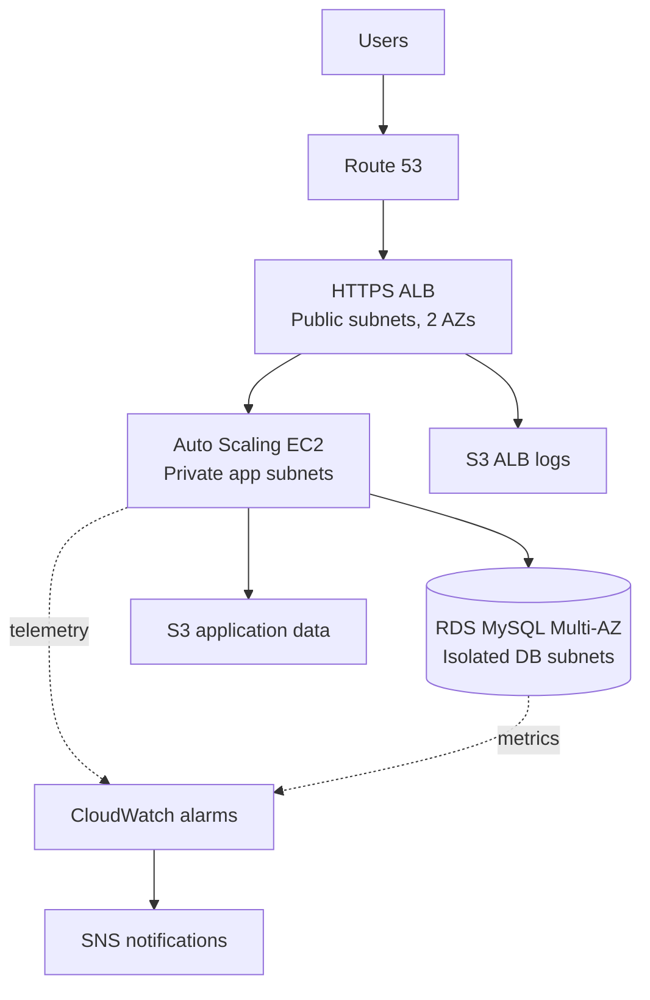

# Production 3-Tier AWS Infrastructure

[](https://github.com/narendra09-devops/terraform-aws-3tier/actions)

A portfolio-ready AWS platform built with reusable Terraform modules. Public traffic terminates at an HTTPS Application Load Balancer; EC2 instances run in private application subnets; MySQL RDS runs in isolated database subnets. The project includes remote state bootstrap, GitHub OIDC, validation/security checks, monitoring, and separate dev/staging/prod configurations.

## Architecture



The full poster is in `diagrams/aws-3tier-architecture-poster.pdf` and the editable Mermaid source is in `diagrams/architecture.mmd`.

## What this proves

- Reusable Terraform modules and environment composition
- Multi-AZ VPC design with public, private-app, and isolated-database subnets
- HTTPS, Auto Scaling, launch templates, health checks, and rolling refreshes
- RDS Multi-AZ, encrypted storage, backups, deletion protection, and Secrets Manager credentials
- IAM least-privilege application role, no inbound SSH, IMDSv2, KMS encryption, and restricted security groups
- CloudWatch logs/dashboard/alarms, SNS alerts, S3 ALB logs, and lifecycle policies
- S3 remote state with native lock files and GitHub Actions OIDC
- `fmt`, `validate`, TFLint, Checkov, plan, approval, and apply controls

## Repository map

```text
terraform-aws-3tier/
├── bootstrap/                 # State bucket and GitHub OIDC role
├── modules/                   # vpc, security, storage, alb, rds, iam, ec2, autoscaling, monitoring
├── environments/              # dev, staging, prod root configurations
├── .github/workflows/         # CI and approval-gated deployment
├── diagrams/                  # Architecture poster and Mermaid source
├── docs/                      # Roadmap, deployment, security, portfolio notes
├── scripts/                   # Local validation/deployment helpers
├── main.tf                    # Composes the platform modules
├── variables.tf
└── outputs.tf
```

## Prerequisites

- Terraform 1.6 or newer
- AWS CLI v2 with a sandbox AWS account/profile
- An ACM certificate in the deployment Region
- A Route 53 hosted zone and domain record for browser-valid HTTPS
- Optional: TFLint and Checkov for local quality checks

> Cost warning: NAT Gateway, ALB, RDS, public IPv4 addresses, CloudWatch, and data transfer can incur charges even with little traffic. Start with `dev`, review the plan, and destroy resources when practice is complete.

## Quick start

### 1. Bootstrap state and GitHub identity

```bash
cd bootstrap
cp terraform.tfvars.example terraform.tfvars
# Edit state_bucket_name and github_repository.
terraform init
terraform plan
terraform apply
```

Save the two outputs. Put the role ARN in GitHub repository variable `AWS_ROLE_ARN`, the bucket in `TF_STATE_BUCKET`, and the Region in `AWS_REGION`.
Commit the generated `.terraform.lock.hcl` files so local and CI runs use the same provider selections.

### 2. Configure dev

```bash
cd ../environments/dev
cp backend.hcl.example backend.hcl
cp terraform.tfvars.example terraform.tfvars
# Replace the bucket, account ID, certificate ARN, email, and optional DNS values.
terraform init -backend-config=backend.hcl
terraform validate
terraform plan -var-file=terraform.tfvars
```

### 3. Deploy only after reviewing the plan

```bash
terraform apply -var-file=terraform.tfvars
```

The SNS email subscription remains pending until you click the confirmation email. If using Route 53, open the `application_url` output after ALB targets become healthy.

### 4. Test and clean up

```bash
curl -I https://YOUR_DOMAIN/health
aws autoscaling describe-auto-scaling-groups --region eu-central-1
terraform destroy -var-file=terraform.tfvars
```

Production has deletion protection and final snapshots enabled. Disable them through a reviewed change before an intentional production teardown; do not bypass them casually.

## CI/CD setup

Create GitHub repository variables:

| Variable | Purpose |
| --- | --- |
| `AWS_ROLE_ARN` | OIDC role assumed by GitHub Actions |
| `TF_STATE_BUCKET` | Remote state bucket |
| `AWS_REGION` | Deployment Region |
| `ACM_CERTIFICATE_ARN` | Regional certificate for HTTPS |
| `ALERT_EMAIL` | Optional SNS subscription |
| `ROUTE53_ZONE_ID` | Optional hosted zone |
| `DOMAIN_NAME` | Certificate-matching application hostname |

Create GitHub environments named `dev`, `staging`, and `prod`; add required reviewers to `prod`. Pull requests run quality checks and a plan when cloud variables are present. Manual `workflow_dispatch` can upload a plan and pause at the selected GitHub environment before applying that exact plan.

The bootstrap role is read-only by default. That is intentional for safe planning. Attach a reviewed, account-specific deployment policy before selecting `apply`; avoid permanent AWS access keys and broad administrator policies.

## Environment differences

| Control | Dev | Staging | Prod |
| --- | ---: | ---: | ---: |
| NAT Gateways | 1 | 1 | 2 (one per AZ) |
| EC2 desired | 1 | 2 | 2 |
| RDS Multi-AZ | No | Yes | Yes |
| RDS backup retention | 7 days | 7 days | 14 days |
| RDS deletion protection | No | No | Yes |
| ALB deletion protection | No | No | Yes |

See [ROADMAP.md](docs/ROADMAP.md) for the build sequence and evidence checklist, [DEPLOYMENT.md](docs/DEPLOYMENT.md) for commands, and [PORTFOLIO.md](docs/PORTFOLIO.md) for resume/interview language.

## Design references

- [AWS Prescriptive Guidance: Terraform AWS Provider best practices](https://docs.aws.amazon.com/prescriptive-guidance/latest/terraform-aws-provider-best-practices/introduction.html)
- [AWS: Application Load Balancer access logs](https://docs.aws.amazon.com/elasticloadbalancing/latest/application/enable-access-logging.html)
- [AWS: EC2 Instance Metadata Service options](https://docs.aws.amazon.com/AWSEC2/latest/UserGuide/configuring-instance-metadata-options.html)
- [GitHub: OpenID Connect in AWS](https://docs.github.com/en/actions/how-tos/secure-your-work/security-harden-deployments/oidc-in-aws)
