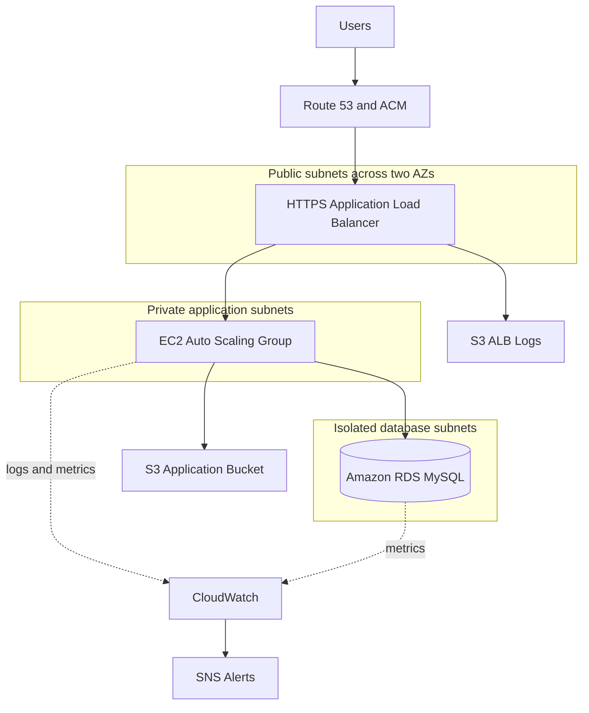

# AWS 3-Tier Infrastructure with Terraform

[](https://github.com/narendra09-devops/terraform-aws-3tier/actions)

An open-source project demonstrating how Terraform can design and provision a secure, scalable, and repeatable three-tier application infrastructure on AWS.

The architecture separates the public entry layer, private application layer, and isolated database layer across two Availability Zones. It combines modular Terraform, AWS security controls, monitoring, remote state, and GitHub Actions validation for `dev`, `staging`, and `prod` deployment profiles.

> The `prod` configuration represents a hardened deployment profile. It does not imply that this repository currently operates a live production workload.

## Project objective

The project addresses a common infrastructure requirement: hosting an application without exposing compute instances or databases directly to the internet.

The solution is designed to provide:

- Separation between public, application, and database tiers
- High-availability options across two Availability Zones
- Automatic EC2 replacement and scaling
- Encrypted storage and centrally managed database credentials
- Restricted tier-to-tier network communication
- Repeatable infrastructure across multiple environments
- Automated Terraform validation and security scanning
- Centralized logs, metrics, dashboards, and alerts

## Current status

| Area | Status |
| --- | --- |
| Reusable Terraform modules | Implemented |
| `dev`, `staging`, and `prod` configurations | Implemented |
| Terraform formatting | Passed locally |
| Development initialization and validation | Passed locally |
| GitHub Actions pipeline | Configured |
| Live AWS deployment evidence | To be documented |
| Scaling and failure-recovery testing | Planned |

## Architecture



Traffic follows this path:

1. Route 53 resolves the application domain.
2. The Application Load Balancer terminates HTTPS traffic.
3. HTTP requests are redirected to HTTPS.
4. The ALB forwards healthy requests to EC2 instances in private subnets.
5. Only the application security group can communicate with RDS on port `3306`.
6. Application and infrastructure telemetry is sent to CloudWatch.
7. CloudWatch alarms publish notifications through SNS.

The full architecture poster is available in [diagrams/aws-3tier-architecture-poster.pdf](diagrams/aws-3tier-architecture-poster.pdf), and its editable Mermaid source is in [diagrams/architecture.mmd](diagrams/architecture.mmd).

## What I implemented

### Networking

- Multi-AZ VPC architecture
- Six subnets across two Availability Zones
- Two public subnets for the ALB and NAT Gateways
- Two private subnets for EC2 application instances
- Two isolated subnets for Amazon RDS
- Internet Gateway for public traffic
- Single or per-AZ NAT Gateway deployment
- Separate route tables for each infrastructure tier
- No default internet route for database subnets
- VPC Flow Logs delivered to CloudWatch

### Compute and traffic management

- Amazon Linux 2023 launch template
- EC2 Auto Scaling Group across private subnets
- Application Load Balancer across public subnets
- HTTPS listener using an ACM certificate
- HTTP-to-HTTPS redirection
- Target-group health checks using `/health`
- ELB-based Auto Scaling health checks
- CPU target-tracking scaling policy
- Rolling instance refresh configuration
- Encrypted `gp3` EBS volumes
- Detailed EC2 monitoring
- Nginx demonstration and health-check pages

### Database and storage

- Private Amazon RDS for MySQL
- RDS subnet group using isolated database subnets
- Multi-AZ RDS option for staging and production profiles
- Encrypted RDS storage using a customer-managed KMS key
- RDS-managed master credentials in AWS Secrets Manager
- Automated backups and controlled maintenance windows
- Enhanced Monitoring and CloudWatch log exports
- Performance Insights for staging and production profiles
- Versioned and encrypted S3 application bucket
- Dedicated S3 bucket for ALB access logs
- S3 lifecycle rules for log retention and archival

### Security

- Separate security groups for ALB, EC2, and RDS
- Public access limited to ALB ports `80` and `443`
- Application access allowed only from the ALB security group
- Database access allowed only from the application security group
- No inbound SSH access
- AWS Systems Manager Session Manager for administrative access
- IMDSv2 enforced on EC2 instances
- IAM instance role with resource-scoped permissions
- Customer-managed KMS key with automatic key rotation
- Database passwords excluded from Terraform variables and Git
- GitHub Actions authentication through OIDC instead of long-lived AWS keys
- Deletion protection and final snapshots in the production profile

### Monitoring and operations

- CloudWatch application log group
- Nginx access and error log collection
- VPC Flow Logs
- CloudWatch operations dashboard
- EC2 CPU alarm
- ALB HTTP 5XX alarm
- RDS CPU alarm
- Encrypted SNS alert topic
- Optional email notification subscription
- ALB access logging to S3

### Infrastructure delivery

- Nine reusable Terraform modules
- Separate `dev`, `staging`, and `prod` configurations
- S3 remote state with versioning and native Terraform lock files
- GitHub OIDC bootstrap configuration
- Terraform formatting and validation
- TFLint quality checks
- Checkov security scanning
- GitHub Actions plan workflow
- Environment-controlled apply workflow
- Manual approval support through GitHub Environments

## Key design decisions

| Decision | Reason |
| --- | --- |
| Public ALB with private EC2 | Prevents direct internet access to application instances |
| Isolated RDS subnets | Keeps the database without an internet route |
| Security-group references | Restricts communication to approved infrastructure tiers |
| Two Availability Zones | Supports instance and Availability Zone failure scenarios |
| One NAT Gateway in dev | Reduces the cost of temporary practice environments |
| NAT Gateway per AZ in prod | Removes cross-AZ NAT dependency |
| RDS-managed credentials | Avoids storing database passwords in code |
| Systems Manager instead of SSH | Removes port `22` and SSH-key management |
| IMDSv2 enforcement | Reduces instance metadata credential exposure |
| GitHub OIDC | Uses temporary AWS credentials instead of repository secrets |
| Environment approval | Adds a manual control before infrastructure changes |
| Separate ALB log bucket | Keeps access logs separate from application data |

## Environment comparison

| Control | Dev | Staging | Prod profile |
| --- | ---: | ---: | ---: |
| VPC CIDR | `10.10.0.0/16` | `10.20.0.0/16` | `10.30.0.0/16` |
| Availability Zones | 2 | 2 | 2 |
| NAT Gateways | 1 | 1 | 2 |
| EC2 instance type | `t3.micro` | `t3.small` | `t3.small` |
| Desired EC2 capacity | 1 | 2 | 2 |
| Maximum EC2 capacity | 2 | 4 | 6 |
| RDS instance class | `db.t4g.micro` | `db.t4g.small` | `db.t4g.small` |
| RDS Multi-AZ | No | Yes | Yes |
| Performance Insights | No | Yes | Yes |
| Backup retention | 7 days | 7 days | 14 days |
| Final RDS snapshot | No | Yes | Yes |
| RDS deletion protection | No | No | Yes |
| ALB deletion protection | No | No | Yes |

The development configuration intentionally prioritizes lower cost over full high availability.

## Terraform modules

| Module | Responsibility |
| --- | --- |
| `vpc` | VPC, subnets, Internet Gateway, NAT Gateways, and routing |
| `security` | Security groups and customer-managed KMS key |
| `storage` | Application bucket and ALB log bucket |
| `alb` | Load balancer, listeners, target group, and access logging |
| `rds` | MySQL database, subnet group, monitoring, and credentials |
| `iam` | EC2 role, policies, and instance profile |
| `ec2` | Launch template, AMI selection, user data, and EBS settings |
| `autoscaling` | Auto Scaling Group, instance refresh, and scaling policy |
| `monitoring` | CloudWatch, VPC Flow Logs, alarms, dashboard, and SNS |

## Repository structure

```text
terraform-aws-3tier/
├── bootstrap/                  # Remote state and GitHub OIDC
├── modules/
│   ├── alb/
│   ├── autoscaling/
│   ├── ec2/
│   ├── iam/
│   ├── monitoring/
│   ├── rds/
│   ├── security/
│   ├── storage/
│   └── vpc/
├── environments/
│   ├── dev/
│   ├── staging/
│   └── prod/
├── .github/workflows/          # Terraform CI/CD workflow
├── diagrams/                   # Architecture source and poster
├── docs/                       # Roadmap, security, and deployment guides
├── scripts/                    # Validation and deployment helpers
├── main.tf                     # Root module composition
├── variables.tf
├── outputs.tf
└── versions.tf
```

## CI/CD workflow

Pull requests and pushes run the quality workflow:

1. `terraform fmt -check`
2. `terraform validate` for all environments
3. TFLint
4. Checkov

When AWS repository variables are configured, pushes and manually triggered workflows can also:

1. Authenticate to AWS using GitHub OIDC.
2. Initialize the remote Terraform backend.
3. Generate an environment-specific Terraform plan.
4. Upload the reviewed plan as a short-lived artifact.
5. Pause at the selected GitHub Environment.
6. Apply the same saved plan after approval.

Pull requests perform quality checks only. GitHub Environment reviewers must be configured separately in the repository settings before approval protection is enforced.

## Prerequisites

- Terraform `1.6` or newer
- AWS provider `6.x`
- AWS CLI v2
- Git
- A dedicated AWS sandbox or development account
- An ACM certificate in the deployment Region
- A matching Route 53 hosted zone and application domain
- TFLint and Checkov for complete local validation

## Validate without deploying

The Terraform source can be initialized and validated without creating AWS resources:

```bash
terraform fmt -check -recursive
terraform -chdir=environments/dev init -backend=false
terraform -chdir=environments/dev validate
```

For complete local quality checks:

```bash
tflint --init
tflint --recursive
checkov --directory . --config-file .checkov.yml
```

Running `init -backend=false` and `validate` does not create AWS infrastructure.

## Deployment workflow

### 1. Bootstrap remote state and GitHub identity

```bash
cd bootstrap
cp terraform.tfvars.example terraform.tfvars
```

Update:

- `state_bucket_name`
- `github_repository`
- `aws_region`
- Approved deployment policy ARNs, when required

Then review and apply:

```bash
terraform init
terraform validate
terraform plan -out=bootstrap.tfplan
terraform apply bootstrap.tfplan
```

The default GitHub role is intentionally read-only. A reviewed, account-specific deployment policy is required before using the apply workflow.

### 2. Configure the development environment

```bash
cd ../environments/dev
cp backend.hcl.example backend.hcl
cp terraform.tfvars.example terraform.tfvars
```

Provide:

- Remote-state bucket name
- AWS Region
- ACM certificate ARN
- Optional SNS email
- Optional Route 53 zone ID and domain name

Never commit `backend.hcl`, `terraform.tfvars`, state files, plan files, AWS credentials, or secret values.

### 3. Create and review the plan

```bash
terraform init -backend-config=backend.hcl
terraform validate
terraform plan -var-file=terraform.tfvars -out=tfplan
terraform show tfplan
```

### 4. Apply the reviewed plan

```bash
terraform apply tfplan
```

### 5. Validate the deployed environment

```bash
terraform output
curl -fsS https://YOUR_DOMAIN/health

aws elbv2 describe-target-health \
  --target-group-arn YOUR_TARGET_GROUP_ARN

aws autoscaling describe-auto-scaling-groups \
  --region eu-central-1

aws rds describe-db-instances \
  --db-instance-identifier three-tier-dev-mysql
```

### 6. Clean up the development environment

```bash
terraform plan -destroy -var-file=terraform.tfvars
terraform destroy -var-file=terraform.tfvars
```

Review the destroy plan carefully. S3 objects and deletion-protected resources can prevent deletion.

## Demonstration scope

The EC2 launch template installs an Nginx demonstration page and exposes a `/health` endpoint. This validates the ALB, target group, Auto Scaling, logging, and monitoring paths.

The application tier receives the RDS endpoint and Secrets Manager ARN, but the demonstration page does not currently execute application-level database queries or S3 operations. A small API with database read/write testing is a planned enhancement.

## Planned evidence

The following evidence will be added after the development deployment is tested:

- Successful GitHub Actions quality run
- Terraform plan summary
- AWS VPC resource map
- Healthy ALB targets
- HTTPS application response
- EC2 instances registered in Systems Manager
- RDS private connectivity and encryption
- Auto Scaling replacement or scaling activity
- CloudWatch dashboard
- Confirmed SNS alert
- Development-environment cleanup result

Sensitive account information, credentials, database values, and resource identifiers will be redacted.

## Project boundaries and future improvements

This project demonstrates application-platform infrastructure. It is not a complete AWS enterprise landing zone.

Potential improvements include:

- AWS WAF and CloudFront
- VPC endpoints to reduce NAT dependency and cost
- AWS GuardDuty, Config, and Security Hub
- Automated Secrets Manager rotation configuration
- Cross-account deployment roles
- Centralized logging
- AWS Backup policies
- Automated integration and resilience testing
- A sample API that reads and writes data in RDS
- Infracost estimates in pull requests
- Multi-Region disaster recovery

## Cost warning

NAT Gateways, the Application Load Balancer, RDS, public IPv4 addresses, CloudWatch, and data transfer can generate charges even when traffic is low.

Use a dedicated sandbox account, configure an AWS Budget, begin with `dev`, review the plan, and destroy practice resources when testing is complete.

## Documentation

- [Implementation roadmap](docs/ROADMAP.md)
- [Deployment runbook](docs/DEPLOYMENT.md)
- [Security design](docs/SECURITY.md)
- [Portfolio and interview notes](docs/PORTFOLIO.md)
- [Architecture poster](diagrams/aws-3tier-architecture-poster.pdf)

## Contributing

Issues, suggestions, and pull requests are welcome. Do not include credentials, Terraform state, real backend configuration, account identifiers, or secret values.

## License

This project is licensed under the [MIT License](LICENSE).

## Author

**Narendra Singh**

- [Portfolio](https://narendrasingh.online/projects)
- [GitHub](https://github.com/narendra09-devops)

## References

- [AWS Prescriptive Guidance: Terraform AWS Provider best practices](https://docs.aws.amazon.com/prescriptive-guidance/latest/terraform-aws-provider-best-practices/introduction.html)
- [AWS: Application Load Balancer access logs](https://docs.aws.amazon.com/elasticloadbalancing/latest/application/enable-access-logging.html)
- [AWS: EC2 Instance Metadata Service options](https://docs.aws.amazon.com/AWSEC2/latest/UserGuide/configuring-instance-metadata-options.html)
- [GitHub: OpenID Connect in AWS](https://docs.github.com/en/actions/how-tos/secure-your-work/security-harden-deployments/oidc-in-aws)
